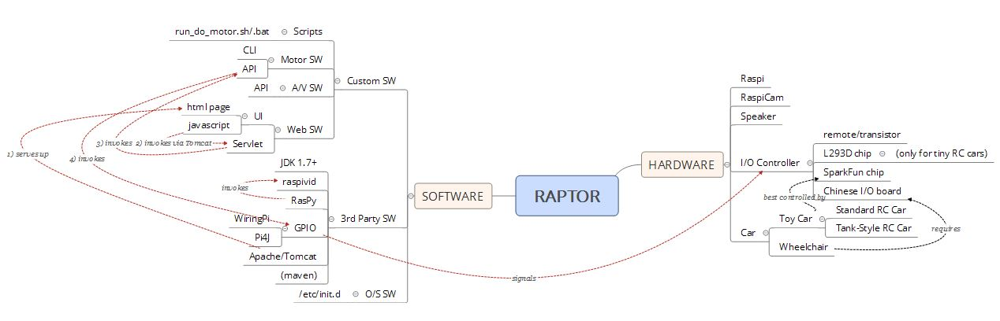

# RAPTOR

 Raspberry Pi Motor Control Project

 A Java project using either the pi4j (http://pi4j.com/) or the wiring pi (http://wiringpi.com/)
 libraries to send control signals to the RasPi GPIO I/O pins  with the intent to control either
 a remote control toy car motor configuration or an electric wheel chair motor configuration.  

 The DoMotorCmd class can be used to issue API commands that trigger GPIO pins and the EgorServlet
 class can be used as a servlet to accept JSON commands that are then sent down to an instance
 of a DoMotorCmd to trigger GPIO pins over an http interface.  

 The io.properties file sets up the primary values for execution.  

 You can run this on a non-RasPi computer (e.g. a Windows computer) in a SIMUTLATION mode; to
 do so, set the SIMULATE_PI field within the io.properties file to true.  

 To run the simple servlet in a dev environment (i.e. with maven)  
 * Change to the rap-web directory
 * run:  mvn jetty:run
 * On browser for raw servlet execution go to:
 * http://localhost:8080/servlets/EgorServlet
 Servlet output will be seen on console and in rap-web/logs

 
 For deployment on a raspi,   
 * Dump the contents of target/rap-web under the
 ../apache/webapps directory, thus creating the webapp:
 ../apache/webapps/rap-web
 * Edit the file rap-web/io.properties file to set up
 the motor configuration that you are going to use
 
 Then, to execute through a browser for index.html execution go to:  
  * http://yourHostIp:8080/rap-web
  

XMind Mindmap:  
